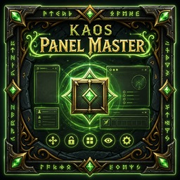
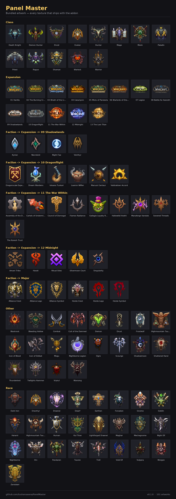

# Ka0s Panel Master


[](https://github.com/tusharsaxena/WowAddonStandards)


<!-- The repo-relative path renders on GitHub today. At first publish this can be swapped for the
     CurseForge CDN URL, which also renders on the project page. The .tga beside it is the asset the
     addon actually loads in-game — WoW cannot read .png or .jpg at runtime. -->


Bundles [LibKa0s](https://github.com/tusharsaxena/LibKa0s) v1.5.0 (MIT).

Ka0s Panel Master draws plain backdrop panels behind your UI, so a screen full of separate frames
reads as a few deliberate groups.

That is all a panel is: a rectangle with a color, a border and a position. It sits **behind**
everything, it holds nothing, and it never moves or touches any of your other frames. Your action
bars, your chat window and your unit frames stay exactly where their own addons put them — the panel
is just the backdrop they sit on.

If you have used kgPanels, or the panels built into ElvUI, this will feel familiar.

Make one with `/pm new`, unlock the screen with `/pm unlock`, drag it where you want it, then `/pm
lock`. Everything else lives in the settings panel or under `/pm config`.

## What's new in 0.1.0

- First release.
- Create as many backdrop panels as you like, each with its own size, position, textures, colors,
  border and frame strata.
- Scale a whole panel — its border, its accent bars and its artwork with it — the way the game's own
  UI scale does.
- Pick any background and border texture you have installed — anything that uses LibSharedMedia
  shares its textures with Panel Master.
- Class-color a panel's background or border with one tick, and it follows whoever you log in as.
- Show a panel only when your cursor is over it, faded to whatever opacity you like the rest of the
  time — without it ever swallowing a click.
- Offset the border away from the panel's edge for a halo, or inward for an inset frame.
- **Accent bars** — a thin strip along any edge of a panel, in the style of BenikUI's panels. On
  out of the box, class-colored, with any status-bar texture you have installed.
- **Panel artwork** — a picture drawn inside a panel's bounds, either one of the pieces bundled with
  the addon or a texture file of your own, with its own color, opacity, fill mode, position, scale,
  quarter-turn rotation, flip, desaturate, blend mode and draw layer. **Fit to artwork** resizes the
  panel to the art's own pixel size in one click. Nothing is drawn until you pick something, so
  panels you already have are unchanged.
- Themes from **Sunn - Viewport Art** packs you already have installed show up in the artwork list
  too, one entry per theme as the whole bar — and they work whether or not Sunn itself is switched
  on. Nothing is bundled: it reads what is on your disk. A panel can also take its shape from
  whatever art it draws.
- Unlock everything at once, or just the one panel you are editing, with a gold outline, a name
  label, a drag handle and optional snap-to-grid.
- Every panel gets a fixed frame name like `PanelMaster_Panel_Chat_BG`, so other addons can anchor
  to it. It is fixed for the panel's whole life — renaming the panel does not break the anchor.
- Test mode drops three sample panels on screen, so you can see what a panel looks like before
  making one of your own.
- Full command-line control: create, rename, delete and edit any field of any panel from `/pm`.
- Copy one panel's whole look onto another in a single click — everything except where it sits.
- Every character shares one layout out of the box, with a **Profiles** page for giving a character
  its own — create, switch, copy and reset profiles.

## Screenshots

<!-- Captured at first release and served from the CurseForge CDN, per .pkgmeta (media/screenshots is
     not shipped to players). -->

*Screenshots are added with the first published release.*

## Usage

### Slash commands

`/pm` is the command; `/panelmaster` does the same thing. Running `/pm` on its own lists everything
below.

| Command | What it does |
|---|---|
| `/pm config` | Open the settings panel |
| `/pm new name` | Create a panel |
| `/pm delete name` | Delete a panel |
| `/pm rename old new` | Rename a panel |
| `/pm panels` | List your panels |
| `/pm panel name [field] [value]` | Look at, or change, one panel. `/pm panel name fitart` fits it to its artwork; `/pm panel deleteall` removes every panel |
| `/pm unlock` | Show every panel with a drag handle |
| `/pm lock` | Put them back to normal |
| `/pm preview` | Toggle three sample panels |
| `/pm recover` | Bring off-screen panels back into view |
| `/pm version` | Print the version you are running |
| `/pm get setting` | Read a setting |
| `/pm set setting value` | Change a setting |
| `/pm list` | List every setting |
| `/pm reset setting` | Put one setting back to normal |
| `/pm resetall` | Put every setting back to normal (your panels are kept) |
| `/pm debug` | Show the debug window. `/pm debug on`/`off` turns logging on and off, `/pm debug dump` writes a state dump into the log |
| `/pm help` | Show this list |

The fields you can change on a panel are `name`, `enabled`, `width`, `height`, `point`, `relPoint`,
`x`, `y`, `strata`, `level`, `scale`, `alpha`, `bgTexture`, `bgColor`, `bgClassColor`, `borderTexture`,
`borderSize`, `borderOffset`, `borderColor`, `borderClassColor`, `mouseover`, `mouseoverAlpha`,
`accentEnabled`, `accentEdges`, `accentTexture`, `accentThickness`, `accentOffset`, `accentColor`,
`accentClassColor`, `accentBorderTexture`, `accentBorderSize`, `accentBorderOffset`,
`accentBorderColor`, `accentBorderClassColor`, `artTexture`, `artCustomPath`, `artColor`,
`artClassColor`, `artAlpha`, `artFill`, `artPoint`, `artX`, `artY`, `artScale`, `artRotation`,
`artFlipH`, `artFlipV`, `artDesaturate`, `artBlend` and `artLayer`. So:

```
/pm panel ChatBG width 420
/pm panel ChatBG bgColor 0.1,0.1,0.12,0.8
/pm panel ChatBG bgTexture blizzard marble
/pm panel ChatBG borderClassColor on
/pm panel ChatBG strata LOW
/pm panel ChatBG accentEnabled on
/pm panel ChatBG accentEdges top,left
/pm panel ChatBG artTexture class-death-knight
/pm panel ChatBG artFill FILL
```

Colors take either `r,g,b` or `r,g,b,a`, in 0–1 or 0–255 — `1,0,0,0.5` and `255,0,0,128` both mean
half-transparent red. Texture names are whatever LibSharedMedia has, and are matched however you
type the capitals. `accentEdges` takes a comma list of `top`, `bottom`, `left`, `right` — or `none`
for no bars at all. `artTexture` takes the id of a bundled artwork (matched however you type the
capitals), `None`, or `Custom`; the five `art*` dropdown fields refuse anything that is not one of
their values and print the real list back at you.

### Anchoring other things to a panel

Every panel has a fixed frame name built from the name you gave it when you created it:
`PanelMaster_Panel_` followed by that name with anything that is not a letter or number turned into
an underscore. A panel created as **Chat BG** is `PanelMaster_Panel_Chat_BG`.

Other addons can anchor to that name:

```lua
myFrame:SetPoint("TOPLEFT", "PanelMaster_Panel_Chat_BG", "TOPLEFT", 4, -4)
```

The frame name is fixed at that moment and never changes again — **renaming a panel does not change
it**, so anything anchored to the panel keeps following it. The trade is that after a rename the
frame name no longer matches the panel's name, and you can no longer work it out from the name
alone. Hover the **Panel name** box in the settings window to see the current one.

### Settings panel

| Setting | What it does |
|---|---|
| Enable panels | Master switch. Off hides every panel without deleting any. |
| Unlock panels | Show every panel with a drag handle and a name label. Resets when you reload. |
| Test mode | Put three sample panels on screen. |
| Debug console | Show the debug window. Resets when you reload. |
| Show names while unlocked | Print each panel's name across it while unlocked. |
| Snap to grid | Round a dragged panel's position to the grid size below. |
| Grid size | How coarse that grid is, in screen units. |
| Default frame strata | The layer new panels start in. |
| Default opacity | How see-through new panels start out. |

The **Profiles** page is Ace's standard profile management: create, switch between, copy and reset
profiles, or bind one per character, class, realm or faction. Everyone starts on the shared
**Default** profile. Switching profiles redraws your panels immediately.

The **Panels** page is where the panels themselves live. Type a name at the top and press Enter (or
click **Okay**), then pick any panel from the dropdown to edit it. One panel is shown at a time, so
the page stays the same size whether you have two panels or twenty.

Each panel's editor has:

| Control | What it does |
|---|---|
| Enabled | Draw this panel at all. |
| Unlock | Give **just this panel** a drag handle, without unlocking the rest. |
| Reset | Put the panel back to how a new one starts. Its name and frame name are kept, so anything anchored to it stays anchored. Test mode's sample panels cannot be reset. |
| Delete | Remove the panel. |
| Panel name | Rename the panel. Press Enter, or click Okay. Its tooltip shows the frame name other addons can anchor to — renaming does not change it. |
| Copy settings from panel | Take on another panel's whole appearance. Its position is **not** copied, so this panel stays put. |
| Width, Height, X offset, Y offset | Size and position. |
| Anchor | Which corner or edge of the screen the offsets are measured from. |
| Frame strata | Which layer the panel sits in. |
| Panel scale | Magnifies the whole panel — its size, its border, its accent bars and its artwork — as one piece, the way the game's own UI scale does. Not the same as changing Width and Height: those resize the panel and leave the border and bars at the thickness you set. Width and Height keep showing the numbers you typed; what changes is how big they turn out on screen. A scaled panel is anchored in its own scaled units, so it also shifts relative to its anchor — nudge the offsets afterwards if it matters. |
| Background texture | Any background texture LibSharedMedia knows about, or **None** for no fill. |
| Background color / Class color | The fill color, or your class color. Its opacity controls the fill alone. |
| Border texture | Any border style LibSharedMedia knows about, or **None** for no border. |
| Border size | Thickness. Starts at 0 — the accent bar defines the edge instead. |
| Border offset | How far the border sits from the panel's edge. Positive pushes it out, negative pulls it in. |
| Border color / Class color | The border color, or your class color. The opacity you set applies either way. |
| Enable accent bar | Draw a thin strip along the panel's edges. **On** by default. |
| Accent bar texture | Any status-bar texture LibSharedMedia knows about. |
| Edges | Which edges get a bar — Top, Bottom, Left, Right, in any combination. Left and right bars turn the texture a quarter turn, so a bar reads the same way round whichever edge it is on. |
| Accent bar thickness | How thick the bar is. |
| Accent bar offset | How far the bar sits from the panel. 0 sits flush (the default), positive detaches it, negative overlaps the panel. |
| Accent bar color / Class color | The bar color. Class color is **on** by default. |
| Accent bar border texture | An edge style for the bar itself, or **None**. |
| Accent bar border size | Thickness of the bar's own border. Defaults to a 1px black hairline. |
| Accent bar border offset | How far that border sits from the bar. |
| Accent bar border color / Class color | The bar border's color, or your class color. |
| Panel opacity | How visible the whole panel is — background, border and accent bar together. Multiplies with the opacity in each color. |
| Show on mouseover only | Keep the panel faded until your cursor is over it. |
| Faded opacity | How visible it is the rest of the time. 0 hides it completely. |
| Defaults (the page's own button, not the editor's) | On the **Panels** page this means *delete every panel* — your settings are left alone. It asks first, and nothing goes until you say yes. |

**Two opacities, and they do different things.** Each color carries its own opacity, which affects
only what that color paints — so you can have a see-through fill inside a solid border. **Panel
opacity** is on top of that and fades the whole panel at once, and it is the level a mouseover panel
fades *up* to.

## How panels work

1. You create a panel and give it a name. It starts as a mid-sized dark rectangle in the middle of
   the screen.
2. You unlock the screen. Every panel puts on a gold outline and its name, and becomes draggable.
3. You drag it where you want it, and resize and recolor it from the settings panel or the command
   line.
4. You lock the screen again. The outline and the label go away, the panel stops taking mouse clicks
   entirely, and it settles into the background layer — behind your bars, your chat and your unit
   frames.

The frame strata is what makes a panel a backdrop rather than an obstruction. New panels start in
`LOW`, which sits above the game world and Blizzard's parchment art but underneath essentially every
interface frame — so you can click straight through it to whatever is on top. All eight of the
game's layers are offered: `BACKGROUND` puts a panel under absolutely everything, and `DIALOG` and
above will cover normal UI, which is occasionally what you want and usually not.

A panel never takes your mouse, whatever layer it is in. That stays true even with **Show on
mouseover only** turned on — the panel watches where your cursor is without claiming the click.

Most of a panel's look is the **accent bar** — a thin colored strip running the full length of an
edge, the look BenikUI's panels are known for. It is on out of the box, so a new panel arrives as a
dark block with a class-colored strip along its top, and the panel's own border starts off so one
thing defines the edge rather than two. Tick whichever edges you want, pick a thickness, and push the
offset positive if you would rather it detached into a separate floating stripe. It draws above the
panel's border, can carry a thin border of its own, and takes any status-bar texture you have
installed. Untick **Enable accent bar** for a plain block.

Out of the box every character shares one set of panels, because most people run one UI. If you want
a character to differ, make it a profile of its own on the **Profiles** page — you can copy your
existing layout into it as a starting point, so nothing has to be rebuilt.

## Panel artwork

A panel can carry a picture as well as a color. Pick one of the pieces bundled with the addon, or
point it at a texture file of your own, and it is drawn inside the panel's bounds — clipped there,
so art that is offset or scaled up cannot spill out over the rest of your UI.

Every panel starts with no artwork at all (`artTexture` is `None`), so nothing you already have
changes until you choose something.

Every piece that ships, in the order the artwork dropdown lists them — the poster groups them under
their category headings, which the dropdown itself does not; it is a flat list that carries each
category as a label prefix instead.

<!-- Repo-relative like the logo above, and for the same reason: it renders on GitHub today and can
     be swapped for the CurseForge CDN URL at first publish. It is GENERATED — regenerate it with
     `python3 tools/artwork/make_poster.py` rather than editing it, since it is built from the same
     scan that writes the catalog. It is a .png, so it does not ship to players; .pkgmeta excludes
     media/poster the way it excludes the logo renders. -->


What you can set per panel:

| Setting | What it does |
|---|---|
| Artwork | Which piece. **None**, one of the bundled pieces, or **Custom path…** for your own file. |
| Custom path | The texture to draw when **Custom** is picked. Only read in that case, so switching to a bundled piece and back does not lose what you typed. |
| Color / Class color | Tints the art, whichever piece it is. The white-on-black pieces are drawn in white, so the tint is what gives them their color; full-color art wants **Desaturate** below first, or the tint only muddies it. Class color works here like it does everywhere else. |
| Desaturate | Drains the art to grayscale *before* the tint applies, so tinting full-color art gives you a clean version of the color you picked instead of mud. Off by default, so nothing you already have changes. |
| Blend mode | **Normal** paints over the panel obeying the image's transparency. **Glow** adds the art's light instead — it can only brighten, never darken, and reads as a lit emblem over a dark panel. |
| Opacity | How solid the art is, on top of the panel's own opacity. |
| Fill | **Native size** draws it at its authored pixel size; **Stretch** fills the panel exactly and ignores scale; **Fill (crop)** covers the panel and crops the overflow; **Fit (contain)** — the default — fits the whole image inside the panel; **Tile** repeats it across the panel. |
| Position, X, Y | Where the art sits in the panel. Only **Native size** and **Fit** honor it — the other three cover the panel exactly, so there is nothing to move. |
| Scale | 0.1 to 4. On **Fill (crop)** it zooms the crop; **Stretch** ignores it. |
| Rotation, Flip | Quarter turns — 0°, 90°, 180°, 270° — and a horizontal and vertical mirror. Flips apply first, then the rotation. |
| Layer | Behind the background, above the background (the default), or above the border and accent bar. |
| Fit to artwork | A button, next to the custom path box. Press it and the panel is resized to the artwork's **exact pixel size**, taking **Scale** and **Rotation** into account — a bundled piece is 1024×1024 and gives a square panel that big; the same piece at scale 0.5 gives 512×512, and a three-section Sunn bar turned 90° gives 256×1536. Large art gives a large panel, so drag it back to the size you want afterwards; press this again any time to return to the artwork's own size. A panel with no artwork, or whose art is not installed, says so and is left alone. |

### Sunn — Viewport Art packs

If you have [Sunn - Viewport Art](https://www.curseforge.com/wow/addons/sunn-viewport-art) and any
of its art packs installed, their themes appear in the artwork dropdown too, grouped under
**Sunn ->**. Nothing is bundled or copied — the addon reads what is already on your disk.

**Only packs you actually have are listed.** A pack you uninstall stops being offered on the next
login, even if Sunn's own saved settings still remember it — so nothing in the dropdown is an entry
that would draw a blank panel.

**You do not need Sunn itself switched on.** The art packs are ordinary texture folders, and Panel
Master can draw them whether or not the addon that came with them is running — it knows what the
twelve official packs contain, and offers a theme only when that pack's folder is really installed.
So you can leave Sunn - Viewport Art disabled, or keep it if you use its viewport bars, and either
way the art shows up here. Sunn shows as **Incompatible** in the AddOn list on current patches
because it has not been updated since 2024; that only matters if you want to run Sunn itself, in
which case tick **Load out of date AddOns**.

A Sunn theme is several files laid side by side into one wide bar, and it is offered as that bar —
one entry per theme, under the theme's own name. The individual sections are not listed: the twelve
official packs are 88 themes, and one entry per section would have made that 270, four fifths of
them fragments of something listed three lines above. If you do want a single strip, point **Custom
path** at it — they are numbered, so
`Interface\AddOns\SunnArtPack2\blackrock2` is the middle of Blackrock.

Every setting above works on a whole bar exactly as it works on a single piece — it is treated as
one wide image and cut up only at the last moment. So **Fit** fits the entire bar, **Fill (crop)**
crops it and may leave only the middle section on screen, a 90° rotation stacks the sections
vertically, and a horizontal flip reverses their order. **Fit to artwork** is worth pressing here: it
gives you the bar at its authored size — 1536×256 for a typical three-section theme — which is the
shape it was drawn for.

Two things to know:

- Packs whose art has a transparent strip along the top declare how much (Sunn uses it to hang that
  strip over the game world). A panel has nothing to hang it over, so that strip is **trimmed**
  instead — the art sits flush in the panel, and **Fit to artwork** measures what you can see rather than the
  padding.
- **Tile** on a whole bar repeats the entire bar rather than each section, and is capped so one
  panel cannot cost hundreds of textures. Past the cap you get fewer, larger repeats — never a bare
  strip. Tiling is also the one case where the transparent strip above is not trimmed, so a tiled
  bar shows its gaps.

Your own file has to be something WoW can load at runtime — a `.tga` or `.blp` inside an addon
folder, written the way the game addresses it, e.g.
`Interface\AddOns\MyStuff\art\crest.tga`. The game cannot read `.png` or `.jpg` at all, and a
texture path it cannot resolve draws nothing and raises no error.

### Contributing artwork

Bundled art lives in `media/artwork/`, and the folder tree IS the catalog. Drop a converted `.tga`
into a folder, run the generator, and the addon picks it up — there is no list to maintain and no
code to touch.

```bash
python3 tools/artwork/artwork_cleaner.py --batch ~/my-art media/artwork
python3 tools/artwork/update_catalog.py
python3 tools/artwork/make_poster.py
```

The third line redraws the contact sheet above. Nothing in the addon reads it, so it is the one
step you can forget without breaking anything — which is exactly why it is written here beside the
two that matter, and why `make_poster.py --check` exists to catch it later.

**Format.** 32-bit TGA with an alpha channel, power-of-two on both axes, square. WoW cannot load
`.png` or `.jpg` at runtime and cannot wrap a non-power-of-two texture at all, which the **Tile**
fill needs. The background must be genuinely transparent — alpha 0, not white and not black —
because the panel's own fill, texture and opacity show through it.

**Everything is derived from the path.** `media/artwork/faction/expansion/12-midnight/harati.tga`
becomes the id `faction-expansion-12-midnight-harati`, the category
`Faction -> Expansion -> 12 Midnight` and the label `Harati`. To rename a piece in the UI, rename
the file; to regroup it, move it. Categories nest as deep as your folders do and sort
alphabetically, which is why numeric prefixes like `12-midnight` are useful.

`w` and `h` are **measured** from the file, not declared. There is no per-asset tint opt-out:
every piece takes the per-panel **Artwork color**, whose default is white and therefore a no-op.
Tinting full-color art directly only muddies it, which is what **Desaturate** is for — it drains
the art to grayscale first, so the tint comes back clean.

The `id` is what gets written into a player's saved variables. **Renaming or moving a shipped file
silently breaks every panel using it** — those panels fall back to drawing no artwork on the next
load, with no error and no warning. Get names right before art ships.

**Licensing.** Contributed art has to be redistributable under a license compatible with this
addon's MIT release — CC0, MIT and public domain are all fine. Anything under a non-commercial or
no-derivatives license cannot ship, and neither can traced Blizzard art submitted as your own work.
Attribution for the currently bundled set is below; the deviation it represents is recorded in
`docs/pending/LEDGER.md`.

If you only want art for **your own** use, none of that applies: convert whatever you like and point
a panel at it with the editor's **Custom path** option, which takes any texture path and needs no
catalog row.

### The artwork pipeline

Three scripts, all using [Pillow](https://python-pillow.org/) — `artwork_cleaner.py` also needs
numpy, the other two do not — with a Real-ESRGAN upscaler vendored under `tools/artwork/bin/`:

| | |
|---|---|
| `artwork_cleaner.py` | any image → the TGA the client loads. `--single` for one file, `--batch` for a tree |
| `update_catalog.py` | reads `media/artwork/` and rewrites the catalog in `modules/Artwork.lua` |
| `make_poster.py` | renders every bundled piece into the one contact sheet under `media/poster/` |

The poster shares `update_catalog.py`'s scan rather than walking the tree again, so the picture and
the catalog cannot disagree about what shipped, and it renders from fonts bundled under
`tools/artwork/fonts/` — a missing font is a hard error rather than a system fallback, because the
same tree has to produce the same picture on anybody's machine. `--check` compares the poster's
pixels rather than its bytes, and a run that would change nothing visible rewrites nothing at all,
so a different Pillow or zlib cannot churn two megabytes of binary into the history. It is stamped
with the addon version from the TOC, which means **a version bump stales the poster** — regenerate
after one.

The cleaner upscales when a source is too small, derives transparency when a source has none,
removes burned-in watermarks on request, and — most importantly — normalizes the color hiding under
transparent pixels, which is what stops an upscaler smearing a halo along every edge.

Full documentation, including how to pick good sources and how to read the per-file report, is in
[`docs/artwork-spec.md`](docs/artwork-spec.md).

**This is an accepted, documented deviation from the [Ka0s WoW Addon
Standard](https://github.com/tusharsaxena/WowAddonStandards).** The standard defines no location for
build tooling, and this is the first non-Lua source in the tree. Accepted on 2026-07-31: keeping the
conversion in the repo is what makes an asset re-derivable and its licensing auditable. `luacheck`
is unaffected — it only walks Lua.

## FAQ

**Does this move my frames around?**
No. It never touches another addon's frames, or Blizzard's. It only draws its own rectangles behind
them. If you want a frame moved, you still move it with whatever addon owns it — Panel Master just
puts something nice behind it.

**Can I put a frame *inside* a panel?**
No, and that is deliberate. A panel is scenery, not a container. Nothing is ever parented into it.

**Will a panel block my clicks?**
Not when locked. A locked panel ignores the mouse completely, so clicks, tooltips and keybinds all
pass straight through to whatever is on top of it. It only takes the mouse while you have the screen
unlocked, which is the whole point of unlocking.

**Do my panels follow me to my alts?**
Yes, by default — every character starts on the same shared profile, so a layout you build once
shows up everywhere. If you want one character to differ, give it its own profile on the **Profiles**
page.

**How many panels can I have?**
As many as you like. They are cheap: a panel is a handful of flat textures and it costs nothing while
it sits there.

**Does it work without any other addons?**
Yes. It is completely self-contained and does not need ElvUI or any suite. It works alongside them
perfectly well, but it never depends on one.

## Troubleshooting

**I made a panel and cannot see it.**
Three usual causes. It might be behind something opaque — try `/pm unlock`, which shows every panel
with an outline and a name regardless. It might be switched off — check `/pm panels`, where a
disabled panel is listed in gray. Or the master switch might be off — `/pm set settings.enabled
true`.

**A panel has ended up off the edge of the screen.**
`/pm recover` brings every stray panel back into view. This never happens by itself, so a panel you
deliberately parked half off-screen stays exactly where you put it.

**I unlocked panels but nothing became draggable.**
If you were in combat, the unlock was queued rather than applied — you will have seen a gray notice
saying so. It happens by itself the moment you leave combat.

**`/pm config` says it cannot open during combat.**
That one is Blizzard's restriction, not a bug: the settings window cannot be switched to while you
are fighting. Run it again once you are out.

**I picked a texture and the panel went plain.**
That texture came from another addon which is no longer loaded. Panel Master keeps your choice and
falls back to a flat fill until the addon is back, so nothing is lost — pick another texture if you
would rather not wait.

**I picked artwork and nothing appeared.**
If it was your own file, the path is the likely cause: WoW can only load a `.tga` or `.blp` from
inside an addon folder, addressed the way the game addresses it, and a path it cannot resolve draws
nothing and raises no error — so a typo looks exactly like having picked **None**. Check the file is
a power of two on both sides too; a texture that is not may fail to load outright. If the artwork is
one of the bundled pieces and *still* nothing shows, check the **Draw layer**: **Behind background**
puts it under the panel's own fill, which hides it completely unless that fill is transparent.

**The addon will not let me create a panel with a name.**
Two panels cannot share a frame name, and the frame name ignores punctuation and spacing — so "Chat
BG" and "Chat-BG" would want the same one. Pick something that differs by more than punctuation.
This can also happen with a name that looks free: a panel *created* as "Alpha" and later renamed
still holds `PanelMaster_Panel_Alpha`, and the message names whichever panel is holding it. Renaming
is never refused for this reason — only creating.

**I renamed a panel and want to know its frame name.**
Renaming does not change it, so anything anchored to the panel still works. But the frame name still
reflects the name the panel was *created* with, so it is no longer something you can work out.
Hover the **Panel name** box in the settings window and it shows you.

**I cannot address a panel whose name has spaces.**
`/pm panel` and `/pm rename` read the name as the first word only. Use the Panels page in the
settings window for those, or give the panel a one-word name.

**I dragged a panel and it jumped somewhere slightly different.**
Snap-to-grid is on. Either turn it off (`/pm set settings.snapToGrid false`) or make the grid finer
(`/pm set settings.gridSize 1`).

**Something is genuinely broken.**
Run `/pm debug on`, reproduce it, then `/pm debug` to open the log and **Copy** to grab the text.
Attaching that to an issue makes it far easier to work out what happened.

## Issues and feature requests

Bugs and ideas both go to [GitHub issues](https://github.com/tusharsaxena/PanelMaster/issues). A
debug log (see above) helps a great deal for anything that looks like a bug.

## Version History

| Version | Notes |
|---|---|
| 0.1.0 | First release. Create, place and style backdrop panels; LibSharedMedia background and border textures; class-color option for both; mouseover-only fade; all eight frame strata; per-panel and global unlock with snap-to-grid; fixed frame names for anchoring; accent bars with their own border; per-panel scale; per-panel artwork from a bundled catalog, your own texture, or a Sunn - Viewport Art pack you already have installed, with tint, fill, position, scale, rotation, flip, draw layer and fit-to-artwork; test mode; copy-settings-between-panels; full command-line control; AceDB profiles. |
